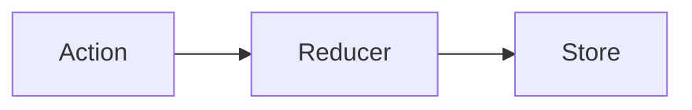

---
presentation:
  theme: "black.css"
---

<!-- slide  -->

Introdução ao Redux

<!-- slide vertical=true -->

Redux
- Anteriormente, em Front-End...
  - React
  - Projeto em grupo
  - RTL
- Hoje
  - Redux Intro
- Em um futuro bem próximo...
  - React + Redux


<!-- slide vertical=true -->
Formalizando...
- Action
As actions definem a operação a ser feita sobre o estado.
Na action, temos a possibilidade de ter duas chaves onde uma é o tipo e a outra um valor para alterar o estado. O tipo da action é imprescindível! O valor é opcional.

<!-- slide vertical=true -->
- Reducer
O reducer recebe as actions realiza as mudanças necessárias e envia a store.

<!-- slide vertical=true -->
- Store
O lugar onde são armazenados os valores manipulados(estados).

<!-- slide -->

Tretas do react...

<!-- slide vertical=true -->
- Prop drilling
- Controle dos estados
- Estrutura rígida

<!-- slide vertical=true -->
Component Hell


<!-- slide vertical=true -->
Como passar estados entre componentes no mesmo nível? 🤔

<!-- slide vertical=true -->
Muita lógica e estados no componente mais alto
```javascript
class App extends React.Component {
  constructor(props) {
    super(props);
    this.state = {
      estado1,
      estado2,
      estado3,
//... estados para $#%*!!
```
<!-- slide vertical=true -->
Redux é uma biblioteca que permite controlar os estados de uma aplicação.
<!-- slide vertical=true -->

Imaginem o seguinte:
Patrick faz um pedido de 2 hamburgueres de siri. Lula Molusco, faz o cálculo do valor total para realizar a cobrança na caixa registradora.
<!-- slide vertical=true -->

Patrick despacha a ação de adicionar 2 hamburgeres de siri em sua conta
<!-- slide vertical=true -->

Lula Molusco interpreta o pedido de Patrick e entra com os dados na caixa registradora.
<!-- slide vertical=true -->

A caixa registradora guarda as informações das transações realizadas.
<!-- slide vertical=true -->

No redux, despachamos ações.
Essas ações são interpretadas pelos reducers.
E, em seguida, armazenadas na store.
<!-- slide vertical=true -->
Action
```javascript
const myAction = { type: 'add_burger', value: 2 }
```
<!-- slide vertical=true -->
Reducer
```javascript
function krustyKrabReducer(state = 0, action) {
  switch(action.type) {
    case add_burger:
      return state + action.value;
    case remove_burger:
      return state - action.value;
    default:
      return state;
  }
}
```
<!-- slide vertical=true -->
Store
```javascript
const myStore = Redux.createStore(krustyKrabReducer);
```
<!-- slide vertical=true -->

Para criar a store, precisamos do reducer, para criar o reducer, precisamos das actions.
<!-- slide vertical=true -->
Bons exercícios! 🙂
